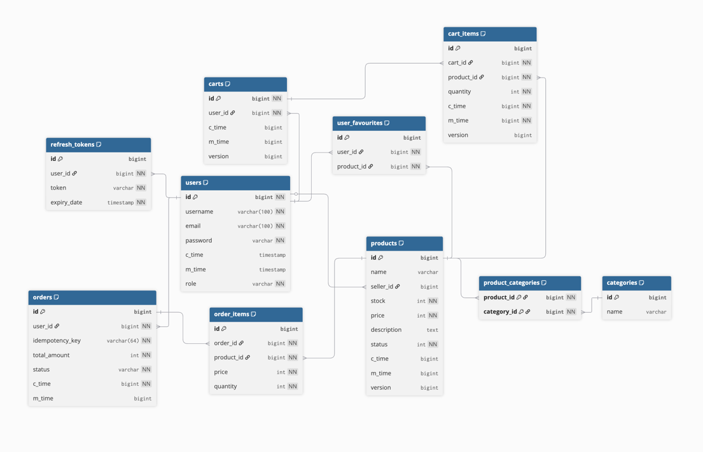

## Assignment

This assignment is designed for developers to build a Spring Boot application for an E-commerce Book/Game/Virtual Product Store with two roles: Admin (adds products) and User (browses, adds to favorites, searches, and buys products).

## My Objectives:

1) Create the BE for an E-Commerce Store using Spring Boot  
2) Support 3 different user types. Customer, Seller and Admins

## Core Requirements:

### Sellers

1. Authentication  
   1. Register  
   2. Login  
   3. Logout  
2. Create Products to be sold to Customers  
   1. Set product name  
   2. Set price  
   3. Set stock  
   4. Set description  
   5. Able to select multiple categories that the product belongs to. (helps filtering)  
3. View **Own** Product  
   1. View All  
      1. Have Pagination/Filtering/Sorting  
   2. View one in detail  
      1. Has more details that may be important to the seller (e.g. c\_time, m\_time)  
4. Update Product Details  
   1. Able to **update Product** Details  
5. Delete Product  
   1. Deletes the product and removes ability from being sold/viewed.   
6. View Orders by Customers  
   1. Views the Order details of sold items

### Customers

1. Authentication  
   1. Register  
   2. Login  
   3. Logout  
2. View all **Available** Products.   
   1. View **all**   
      1. Have Pagination/Filtering/Sorting  
   2. View one in detail  
      1. Has more details but not all (e.g. don’t show c\_time, m\_time)  
3. Favourite List  
   1. View All Favourites  
      1. Have Pagination/Filtering/Sorting  
   2. Able to **Add product** to Favourite List  
   3. Able to **Remove products** from Favourite List  
   4. *When products are made **not Available**, should not be in favourites list*  
4. Cart  
   1. Able to add **Available** Product to Cart  
      1. Able to **specify quantity**  
   2. Able to update quantity of product from cart  
   3. Able to **remove cart item**  
   4. Able to **View** the cart items  
   5. Able to **Checkout** based on **current** Cart  
      1. Allow **selection of cart items** to checkout  
      2. Successful checkout should **only remove** selected items

\*Not going to handle payment

### Admin

5. Authentication  
   1. Register  
   2. Login  
   3. Logout  
6. View all **Non-Deleted** Products.   
   1. View **all**   
      1. Have Pagination/Filtering/Sorting  
   2. View specific seller products  
   3. View one in detail  
      1. Same details as the seller.  
7. Create Product for Seller   
8. Change Product Status  
   1. Set Inactive to Active  
   2. Set Active to Inactive  
      1. *Similar idea to being banned*  
9. Category  
   1. Create Categories for products  
   2. Delete Categories for products  
10. Orders  
    1. View **all** orders  
       1. Have Pagination/Filtering/Sorting

## Implementation

### Software Architecture

Why Monoliths

* **Lower complexity**: A single codebase avoids unnecessary concerns such as service discovery, API gateways, and inter-service communication.

* **Faster development and iteration**: Features can be implemented end-to-end without coordinating between multiple services.

* **Easier debugging and testing**: The entire application can be run and tested locally without distributed tooling.

#### Acknowledged Trade-offs

* **Limited scalability**: Individual modules cannot be scaled independently.

* **Tighter coupling risk**: Without careful design, domain logic can become interdependent.

* **Single deployment unit**: Any change requires redeploying the application.

### API Architecture

**Architecture context**

* Project is a **monolith**, with most interactions happening **in-process**

* Network-based service-to-service communication does **not** exist

| REST (HTTP/JSON) | RPC (e.g. gRPC) |
| :---- | :---- |
| Simple to implement and understand | Adds build, versioning, and tooling complexity |
| Easy to test and demo (Swagger, curl, Postman) | Harder to debug and demonstrate  |
| Well-suited for external APIs at the system boundary | Designed for network-based service-to-service communication |

**Conclusion**

* REST is the better fit for this project due to its simplicity and clarity

* RPC would add complexity without meaningful benefits

* RPC becomes relevant only if the system is later split into true microservices

### Authorisation Framework

* For this project i want to try to implement the core IAM featues to better understand so i will use **JWT with Spring Security** is the cleanest because it achieves stateless auth with minimal infrastructure and keeps the focus on the API and business logic.
* want to implement the access-token refresh-token flow to balance security and usability.

### Database Design

